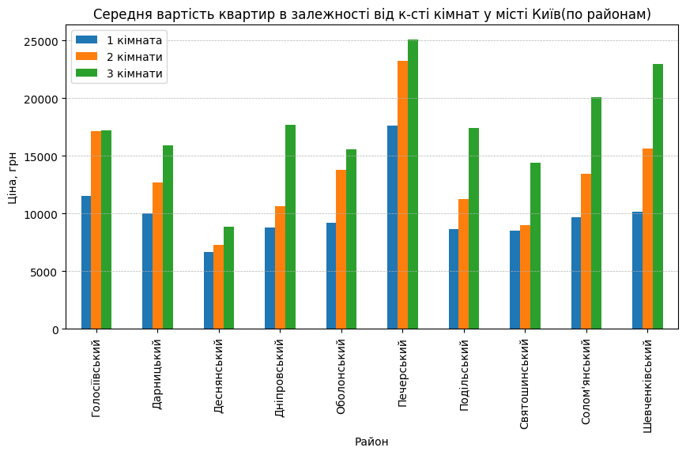

# Flat's rent analysis
Parse advertisements about flat's rent from olx.ua and analysis their price depends on city, district, number of rooms, type of walls, heating, repair.

## Installation

```bash
git clone git@github.com:zhulich/flat_rent_analysis.git
python3 -m venv env
source env/bin/activate
pip install -r requirements.txt
```

## Features
- Parse all advertisements around the country or single city.
- Analysis price for country, region, city, district.
- Analysis by any of proposed criterion: rooms, walls, repair, heating, square, floor.


